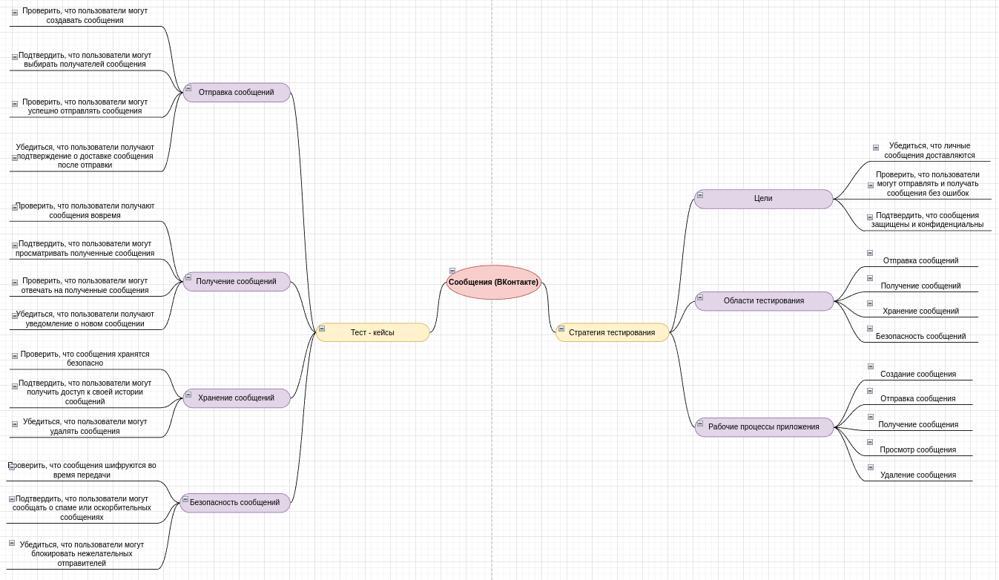

# CalculatorCSharp

## Описание

Цель проекта: 

## Технологии

- C#
- MSTest
- XUnit
- Draw.io

## Calculator
Для запуска программы введите следующие команду в терминале: 

<b>cd Calculator</b> 
<b>dotnet run Calculator.cs</b> 

## Tests Calculator
Для запуска тестов введите следующие команду в терминале: 

<b>cd Calculator</b> 
<b>dotnet test</b> 

## Mind Map (Тест-план для личных сообщений ВКонтакте)

